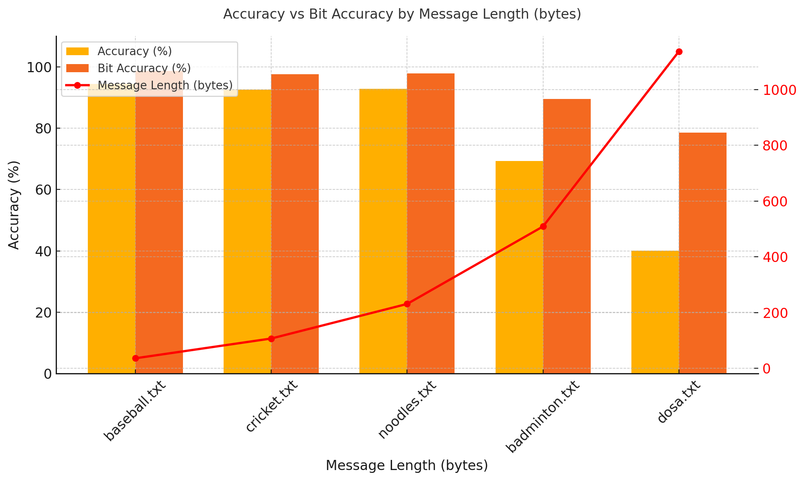
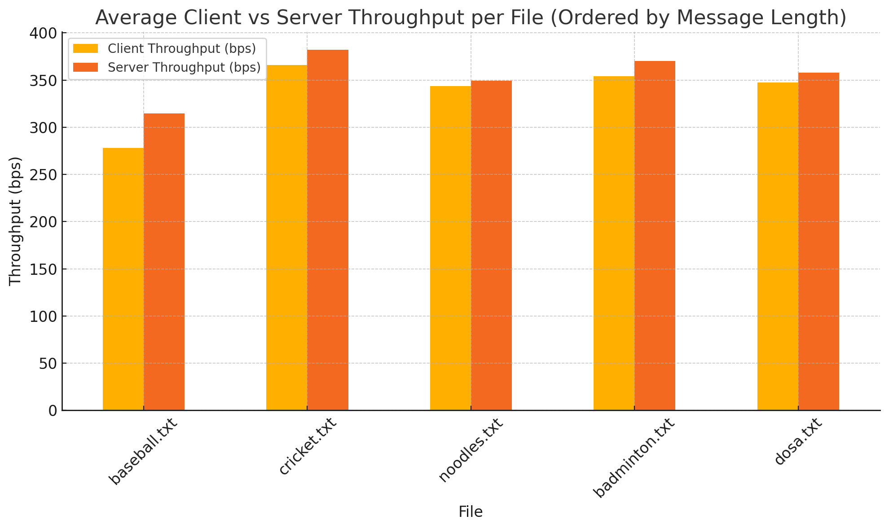

# Covert Channels
Contributors: Matheu Campbell (mgc2171), Isaac Trost (wit2102), Denzel Farmer (df2817), Devon Campbell (dec2180)

## Work Log
We met twice over the course of the assignment and communicated progress asynchronously throughout. Each member contributed equally to this work.  

## Reflection report
### Technique 1: Flush + Reload
(Explanation)
(Why believed technique would work)
(Expected bandwidth vs actual bandwidth achieved)
(Hardware specs & any information required for reproducing your results)

### Technique 2: Prime + Probe
This project implements a microarchitectural covert channel using the Prime+Probe cache side-channel technique to transmit data between isolated processes. The sender and receiver coordinate by targeting a shared last-level cache (LLC) set. To transmit a bit, the sender either evicts the cache set (encoding a `1`) or remains idle (encoding a `0`). The receiver probes the same set and infers the transmitted bit by measuring access latency: high latency implies eviction (`1`), low latency implies no eviction (`0`).

Synchronization is achieved using the processor’s timestamp counter (`rdtscp`), with both parties aligning to defined time slots via a `SLOT_MASK`. Shared cache set contention is ensured by selecting memory addresses that map to a specific LLC set (`TARGET_SET`) using large page mappings (`/dev/hugepages`), which also reduce TLB misses and improve physical address predictability.

To add reliability, the channel uses an Automatic Repeat reQuest (ARQ) protocol. Each frame includes start delimiters, parity bits, and sequence numbers, enabling the receiver to detect errors, discard stale frames, and request retransmissions. Together, these design choices allow for robust, stealthy communication via cache timing variations, without requiring shared memory or direct interprocess communication.

#### Bandwidth
##### Expected
At a high level, **bandwidth (in bits/sec)** can be estimated using:

```text
bandwidth = bits_per_frame / time_per_frame
```

Or, over the full transmission:

```text
bandwidth = total_bits_sent / total_time_taken
```

In this implementation, each ARQ frame consists of:

- 6 bits → initial sequence number  
- 8 bits → start delimiter  
- 8 bits → data  
- 1 bit  → parity  
- 5 bits → final sequence number  

**Total: 28 bits per frame**

Each bit occupies a fixed time slot, defined by `SLOT_MASK` in `phy.c`. For example:

```c
#define SLOT_MASK 0x3FFFF
```

This means the slot counter repeats every `2^18 = 262,144` cycles. On **GCP AMD EPYC "Rome"** CPUs (2.25 GHz), this translates to:

```
262,144 cycles ÷ 2.25 cycles/ns ≈ 116,508 ns ≈ 116.5 μs per slot
```

Thus, a single frame takes:

```
28 bits × 116.5 μs ≈ 3.26 milliseconds
```

And the theoretical bandwidth is:

```
Bits per second = 1 / 116.5e-6 × 28 ≈ 240,000 bits/sec ≈ 30,000 bytes/sec
```

**Note:** This is a best-case estimate. Real-world performance is lower due to:
- Retransmissions on timeout when a frame is lost or corrupted
- ACK delay (Each frame sent requires a correctly received ACK before the next can be transmitted)
- Cache contention or interference (other processes, cores, or interrupts may use the same cache set)
- Logging/printing delays

##### Actual 





#### Hardware specs & information to run
This experiment was conducted on a `e2-standard-4` GCP instance (4 vCPUs, 16 GB RAM) using the AMD EPYC Rome platform, which runs at a base frequency of 2.25 GHz. The machine uses 1 vCPU per physical core, which helps eliminate interference from sibling threads on the same core. 2 vCPUs were used, allowing the sender and receiver to be isolated on separate physical cores via `taskset -c 0` (server) and `taskset -c 1` (client), ensuring clearer timing behavior and reducing scheduling noise.

System Requirements:
- Requires `/dev/hugepages` to be mounted (for shared memory)
- Tested on modern Intel CPUs with inclusive LLC
- Run client and server on isolated cores (`taskset -c`)
- May require `sudo` to access huge pages or perform low-level ops

Running the channel:
```bash
# Enable huge pages
sudo sysctl -w vm.nr_hugepages=8
sudo mkdir -p /dev/hugepages
sudo mount -t hugetlbfs none /dev/hugepages

# Terminal 1 (Server)
sudo taskset -c 0 ./arq_server

# Terminal 2 (Client)
sudo taskset -c 1 ./arq_client "HELLO WORLD"
```

# Technique 3: Return Address Stack (RAS)
## Theory
### Microarchitectural Basis
The return address stack (RAS) is a microarchitectural structure that optimizes function 
calls. Every time a function is called, its return address is added to the stack. When the 
function completes execution, its return branch may be executed speculatively simply by popping the top of the stack. Because it's a microarchitectural structure, the RAS size is limited, so if the call stack is too deeply nested, earlier return branches are ejected, and their return addresses must be computed directly, costing execution time.

### RAS Timing Side-Channel
The limited capacity of the RAS, combined with the fact that it is shared among all 
processes on a core, exposes a potential side-channel that can be used to build a covert 
channel. A sending process is able to influence the time taken for a receiving process to 
return from a heavily nested process by flushing the RAS with its own heavily nested 
process.

### Implementation
To flesh out the covert channel implementation, we first need to know the size of the 
return address stack. To maximize the covert channel's accuracy, we will want to configure 
the receiving process to be nested exactly as deeply as the RAS is. This is the point at which the difference in return times is largest. RAS size can be 
benchmarked by timing execution time for increasingly nested functions and identifying the inflection point where the additional execution time per level of nesting increases. A graph is shown below, showing the time to return from a nested function with no other overhead. 


On the Google Cloud Instance, the RAS capacity is 16.

Once the RAS capacity is known, the implementation of the send and receive functions are as follows:

```
// SENDING
static inline void flush_ras(int count, int threshold){
    if (count == threshold) {
        sched_yield();
        return;
    }
    else flush_ras(++count, threshold);
}

// RECEIVING
static inline uint64_t recurse_and_yield(int depth, int count){
    if (count == depth){
        // Yield to transmitter process
        sched_yield();
        return rdtscp64();
    }else{
        if (count == 0){  // Last to return (assuming depth > 0)
            uint64_t start = recurse_and_yield(depth, count+1);
            return rdtscp64() - start;
        }
        else return recurse_and_yield(depth, count+1);
    }
}
```

To exchange information, the receiver first descends to its full depth of recursion. At 
this point, the RAS is now full with the receiver's return addresses. Then, it yields control to other 
processes on the core. At this point, the sender may flush the RAS by calling its own 
nested functions, or it may not. By measuring the time to return from its nested calls, the 
receiver can determine the activity of the sending method. If the return time is above a certain
threshold, the incoming bit is interpreted as a 1.

## Results
### Basic Case
In the basic case, the sender-receiver structure works fairly well. That is, sending a constant stream
of either ones or zeros leads close to perfect accuracy with reasonable bandwidth.

```
| Target Bit  | Bandwidth (kb/s) | Accuracy |
|      0      |      581         |   96.0%  |
|      1      |      203         |   99.9%  |
```

Note firstly that these tests were performed using a cycle threshold obtained as the average
of average flush return times and average non-flushed return times.
Next, note the difference in bandwidth between the all zero and the all ones case. The likely
cause is the need for the receiver to wait for the sender's RAS flush when receiving a 1. For
a load consisting of a roughly even number of ones and zeros, we expect a bandwidth that's
roughly average the two experimental values.

The theoretical bandwidth is limited only by the speed of the nested function invocations and timing logic. At their
most optimized, the bare-bones recursive calls and system timestamp calls required to make this method
work should run on the order of tens of cycles per bit. For an even mix of ones and zeros, we expect the per-
bit execution time in cycles to be roughly 150 (~100 for 0s, ~200 for 1s; per the benchmark data). We 
can then compute the expected bandwidth for a 2.6 GHz processor of 2.6 GHz / 150 = 17 kb/s.

### More Advanced Transmission
To test the channel's effectiveness with more sophisticated loads, we wrap the basic channel
in an ARQ protocol, the core of which remains the receive_bit and send_bit functions (details
of the ARQ wrapper found in the flush and reload section). This adds some complication to the
implementation. 

1. Threshold detection from a single process requires careful multithreading, and it takes
relatively long, making it reasonable to compute the detection threshold only once per
communication session, rather than once per data packet. The threshold is prone to drift due to 
competing processe as well as processor voltage control and power saving settings, and any
changes during communication will disrupt the channel. 
2. In the more advanced case, time synchronization becomes crucial. The sender-receiver method
requires precise juggling of processor control. To mitigate perturbations, the receive and send
methods average across roughly 600 instances to decide the final return time, but the timing
is still imperfect.
3. The channel seems to exhibit a kind of inertia, where quickly swapping between sending ones 
and zeros is unreliable. It's unclear what causes this, but it's likely related to the process
control involved and the added overhead from the ARQ wrapper. Ultimately, this prevents the 
channel from correctly assembling valid packets and the receiver from interpreting them. Averages
of receiveed bits across larger time frames could likely be taken, but with a massive penalty to
bandwidth.

## Codebase
There are two relevant subdirectories in this directory.

`./basic` - Contains code for a basic implementation of the covert-channel. Running `make` will generate four executables: `benchmark`, `threshold`, `sender`, and `receiver`.
- `benchmark`: Generates data that can be plotted to determine RAS size.
- `threshold`: Continuously averages return time for a flushed and non-flushed RAS.
- `sender`: Repeatedly flushes the RAS to send ones (note: must use taskset to pin to the same CPU as receiver)
- `receiver`: Repeatedly checks nested return time to read incoming data from sender (note: must use taskset to pin to the same CPU as sender)

`./arq_ras` - Contains a client-server ARQ implementation with the RAS channel as its backend. Run `make all` to generate tests and targets, and `make test` for tests only.
- `arq_client` - the ARQ client; sends bits as requested when the server is running. Run using `taskset -c 0 ./arq_client <message>`
- `arq_server` - the ARQ server; listens for and acknowledges incoming messages. Run using `taskset -c 0 ./arq_server`
- `send_bitstream` - Repeatedly sends a bitstream to the listener function. Run using `taskset -c 0 ./send_bitstream <bitstream>`
- `receive_bistream` - Constantly listens for incoming bitstream. Run using `taskset -c 0 ./receive_bitstream`

## Cloud Instance Parameters
```
machine-type: n2-standard-2
CPU Platform: Intel Cascade Lake
Architecture: x86/64
```


### Technique 4: Port
# Network Port Occupation
## Description
This covert chanel tenique uses communication via occupying network ports to communicate between two processes from different users.

## Usage
first make the code
```bash 
make
```

Then, on one terminal, run the receiver:
```bash
./receiver
```
Then, on another terminal, under a separate user account, run the sender:
```bash
./sender <data_file>
```

The receiver will print all of the data, so to store it in a file, pipe its output to that file.

## Details
The protocal operates by defining a sender and a reciever port, that that process solely controls, then a number of data ports.
At the moment, the data ports are defined sequentially from the sender port, and the sender port, reciever port, and number of data ports are defined in the header file.

The sender sends n bits at a time, by first occupying the sender port, then occupying a particular data port if the corosponding bit is a 1, and not if it is a 0.

Once it has done this for all of the data ports, it releases the sender port, and waits for the reciever to occupy the reciever port, then to release it, before starting the process over.

The reciever will wait for the sender port to be released, then will read the data ports in a similar way, then it will release the reciever port, and wait for the sender to occupy then release the sender port.

## Limitations
* The sender and reciever ports must be defined in the header file, and the data ports are defined sequentially from the sender port. This means that if things are occupying those ports on the server, the whole protocal will break.
* The receiver will recieve all 0s for the data for "padding" of sorts, and does not have a way to tell where the actual end of the data is.
* The reciever only knows the transmission is done when it times out.
* The fewer data ports you use, the worse performance is, both in terms of reliability and speed, as the fast switching on the port requires more coordination that is more likely to fail.

## Performance
The only type of error that occers is when the sender or reciever is not fast enough, times out, and in the programs recovery the reciever gets the same block of data twice or not at all.
That said, this is very very rare, happening 0 or 1 times in sending a half a kilobyte file with 256 data ports. The error rate is < 0.01% for 256 data ports, which stays consistant for large files.
With fewer data ports, this number tends to go up, as well as the speed going down, as shown below


These tests were performed sending a 32 kb file twice, with average miss rate (per bit) and average bits per second shown.
