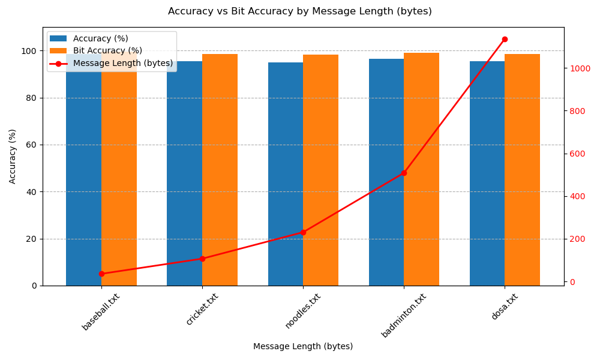
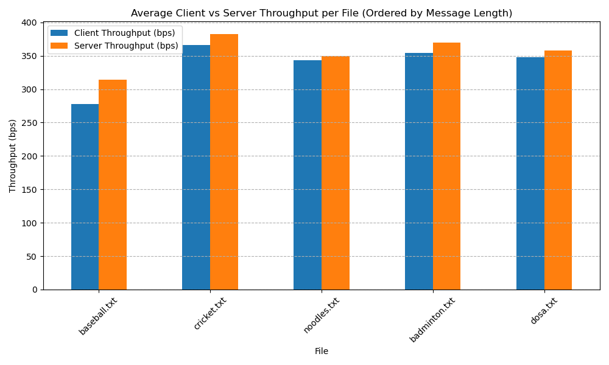
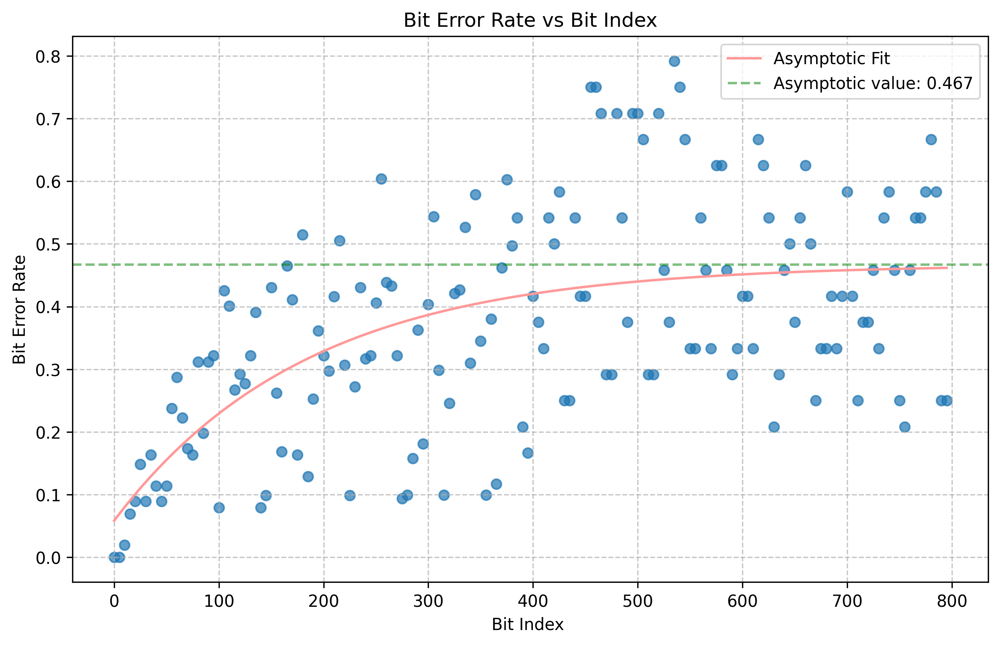
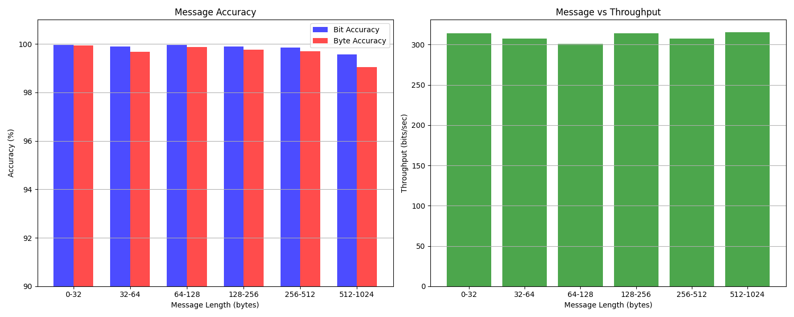

# Covert Channels
Contributors: Matheu Campbell (mgc2171), Isaac Trost (wit2102), Denzel Farmer (df2817), Devon Campbell (dec2180)

## Work Log
We met twice over the course of the assignment and communicated progress asynchronously throughout. Each member contributed equally to this work.  

## Summary 
We experimented with four techniques, each of which had specific tradeoffs:
1. Flush and Reload (cache-based, uarch)
2. Prime and Probe (cache-based, uarch)
3. Return Address Stack (RAS-based, uarch)
4. Network Port Occupancy (port-based, OS)

The first three are microarchitecture based, and so are much slower and less reliable than the last (which operates at the OS level).
To make the first two microarchitecture channels usable (i.e. reduce transmission errors), we built a bi-directional,
error-correcting ARQ protocol.


## Repository Structure
The repository contains a directory for development/testing of each technique, as well as a `cache_channels` directory which contains duplicate
implementations of prime/probe and flush/reload wrapped in the most up-to-date ARQ protocol implementation.

Each folder contains a `Makefile` that builds relevant binaries.

## Cache-Based Channels
Our first two techniques are both cache-based side channels: flush/reload and prime/probe. They each 
operate at the bit level, and synchronize sending with the processor time counter from `rdtscp`.

The two core challenges shared by both were synchronization and interference. One sender/receiver pair can
only communicate a handful of 'raw' bits before their timing becomes misaligned. In addition, if there is
interference then a number of bits can all be corrupted. To address these, we implement a bi-directional ARQ 
protocol that sends frames which each wrap one byte of data. The details of this protocol are described at the
end of this section.

### Environment
All our usage and results were run on a Google Cloud `c2-standard-4` VM. This machine has an Intel(R) Xeon(R) CPU
running at 3.10GHz. Most importantly, it is a 'sole-tenancy' machine meaning we are not colocating with other customers.

To match results, parameters almost certainly need to be tuned: for example, the flush+reload cycle period and the ARQ
protocol timeout likely need tuning if the environment changes. 

### Usage 
To run each of these side-channels, run `make flush_reload` or `make prime_probe` in the `cache_channels` directory. Each of these
will produce a `client`, `server`, and `benchmark` executable.

To transmit a message with the client/server executables, open two terminals:
1. In the server terminal, run `./server <server_outfile>` where `server_outfile` is a file where the received message will be stored
2. In the client terminal run `./client <message> <client_outfile>` where `message` is the message to transmit and `client_outfile` is a
file where the sent message will be stored.
3. Wait for the client to transmit the message, then compare the server output file with the client output file

Note that you will usually need to restart the server before sending another client message, because of frame sequence numbering. 

To benchmark the speed of each, use the benchmark executable `./benchmark <input_file>` where `input_file` is an existing
file to transmit. This will launch the client and server as separate processes, transmit the file from client to server,
and print statistics about accuracy and throughput. This will also save a file `benchmark_server.log` with the file received 
by the server.

### Technique 1: Flush + Reload
This is a cache-based flush+reload covert channel to send a small number of bits reliably, the primitive required by the
ARQ protocol. A sender and receiver coordinate based on a shared memory address and the processor's timestamp (from the
`rdtscp` instruction). 

#### Sender
Single bit transmission happens with a period of roughly `FR_PERIOD_CYCLES` clock cycles. To transmit a bit, the sender does
the following:
1. Spins until the current clock cycle falls at the beginning of a period (with `FR_SYNC_RANGE` cycles of allowance). 
2. Once it detects a new period, the sender either spins (to send a 0) or repeatedly flushes the cache at the target address as quickly as possible using the `clflush` instruction (to send a 1), yielding the CPU after each flush.
3. Once it reaches the end of the send period (half the full period), the sender returns.
4. The remaining half of the full period allows for both the sender and reciever to perform some
minimal operations (e.g. saving results) before waiting on the next period.

#### Reciever
The receiver begins by profiling once per instance (i.e. client or server), before the sender transmits. This involves 
measuring many iterations of randomly either flushing or preloading a cache line, then accessing that line. The threshold
time for a cache miss is set to 25% of the difference between the average cache hit and miss times added to the average 
hit time.  

After saving this threshold, the reciever is ready to receive bits. To read a bit currently being sent, the receiver does
the following:
1. Spins until the current clock cycle falls at the beginning of a period (again with `FR_SYNC_RANGE` allowance).
2. Until the end of the send period, the reciever repeatedly measures access time to the target location, maintaining a counter of total time and total accesses time. After each access the receiver yields the CPU.
3. At the end of the send period (halfway through the full period), the reciever calculates the average
access time and returns 1 if it is greater than the measured threshold (i.e. the sender was likely flushing, inducing
misses).

This works because both the sender and reciever are accessing the same location in memory via the same cache. When the
sender flushes repeatedly, this slows down the receiver's accesses and affects the average threshold. 

#### Expected (Raw) Bandwidth

The expected bandwidth for this channel depends heavily on the chosen period length. A longer period improves accuracy,
but slows down transmission. Assuming ideal accuracy, however, we can calculate the expected time to transmit a single bit
as one period. Then, the expected bandwith (in bits per second) can be calculated as:
```
raw bandwidth (bits / sec) = (1 (bits) / period (cycles)) * (frequency (cycles) / 1 sec)
```

Our test machine advertises a frequency of 3.1 GHz, and using a period of 131071 cycles, an estimated bandwith
would be ~23600 bits per second. Note that this is raw, and doesn't take into account error correction by the higher
level protocol. 

Benchmarking just the send and recieve bit calls gives a "bandwidth" which matches almost exactly of ~23400 bits per second,
but an accuracy that is only just higher than 50% (barely better than guessing) because the sender and reciever become
out-of-sync almost immediately.

#### Actual Bandwidth and Accuracy

For more a realistic measurement of real bandwidth, we must also consider accuracy. This motivates creating the ARQ
protocol, which creates a client and a server that communciate bidirectionally via frames and acknowledgements, identified
by recognizable bit sequences that effectively 'reset' any sender/reciever drift. The communcation overhead reduces
throughput, but increases accuracy to a reasonable level. 

The following charts show bandwidth and accuracy for files transfers of various lengths on a benchmark machine, after 
tuning parameters. This uses an initial version of ARQ, which has slightly less redundancy than the our later version.

 



As shown, the accuracy is stays above 90% for short messages. Because the protocol does include sequence numbers, for
very large messages it may breakdown. However, the ability to consistently transfer ~512 byte files with near 100%
accuracy means the channel is more than accurate enough to act as a semi-reliable means of transmitting multi-byte frames
for higher level protocols that include more robust error correction or retransmission.

The throughput is much lower than the theoretical 'ideal' bandwidth, sitting at around ~350 bits / second. Over 99% of the
theoretical bandwidth is used for the protocol, which is optimized for accuracy over throughput. Tuning the protocol
further might be able to make incremental gains, particularly if targeting a specific packet size (e.g. 256 or 512 bytes).

Qualitatively, when there are failures in accuracy it is usually due to major interference that corrupts a large number
of bits all at once. 

### Technique 2: Prime + Probe
Our second covert channel uses the Prime+Probe cache side-channel technique to transmit data between isolated processes. The sender and receiver coordinate by targeting a shared last-level cache (LLC) set. To transmit a bit, the sender either evicts the cache set (encoding a `1`) or remains idle (encoding a `0`). The receiver probes the same set and infers the transmitted bit by measuring access latency: high latency implies eviction (`1`), low latency implies no eviction (`0`).

Synchronization is achieved using the processor’s timestamp counter (`rdtscp`), with both parties aligning to defined time slots via a `SLOT_MASK`. Shared cache set contention is ensured by selecting memory addresses that map to a specific LLC set (`TARGET_SET`) using large page mappings (`/dev/hugepages`), which also reduce TLB misses and improve physical address predictability.

To add reliability, the channel also uses the ARQ protocol. Each frame includes start delimiters, parity bits, and sequence numbers, enabling the receiver to detect errors, discard stale frames, and request retransmissions. Together, these design choices allow for robust, stealthy communication via cache timing variations, without requiring shared memory or direct interprocess communication.

#### Expected Bandwidth
At a high level, **bandwidth (in bits/sec)** can be estimated using:

```text
bandwidth = bits_per_frame / time_per_frame
```

Or, over the full transmission:

```text
bandwidth = total_bits_sent / total_time_taken
```

In this implementation, each ARQ frame consists of:

- 6 bits → initial sequence number  
- 8 bits → start delimiter  
- 8 bits → data  
- 1 bit  → parity  
- 5 bits → final sequence number  

**Total: 28 bits per frame**

Each bit occupies a fixed time slot, defined by `SLOT_MASK` in `phy.c`. For example:

```c
#define SLOT_MASK 0x3FFFF
```

This means the slot counter repeats every `2^18 = 262,144` cycles. On **GCP AMD EPYC "Rome"** CPUs (2.25 GHz), this translates to:

```
262,144 cycles ÷ 2.25 cycles/ns ≈ 116,508 ns ≈ 116.5 μs per slot
```

Thus, a single frame takes:

```
28 bits × 116.5 μs ≈ 3.26 milliseconds
```

And the theoretical bandwidth is:

```
Bits per second = 1 / 116.5e-6 × 28 ≈ 240,000 bits/sec ≈ 30,000 bytes/sec
```

**Note:** This is a best-case estimate. Real-world performance is lower due to:
- Retransmissions on timeout when a frame is lost or corrupted
- ACK delay (Each frame sent requires a correctly received ACK before the next can be transmitted)
- Cache contention or interference (other processes, cores, or interrupts may use the same cache set)
- Logging/printing delays

#### Actual Bandwidth and Accuracy


The benchmark results demonstrate key performance characteristics of the Prime+Probe ARQ covert channel across varying message lengths. In the **throughput plot**, we observe relatively consistent transmission rates (~280–380 bps), with minor variance between client and server throughput. This consistency suggests effective synchronization and slot alignment, with larger messages achieving slightly better utilization.

In contrast, the **accuracy plot** reveals a clear trade-off between message length and transmission integrity. As message size increases, **overall accuracy drops**, especially for `dosa.txt`, where character-level accuracy falls to ~40% despite high bit-level accuracy (~78%). This discrepancy implies that most bit errors are concentrated in just a few characters, likely causing frame-level corruption despite majority of bits being correctly received. The plotted red line confirms that **message length is a major stressor**, with longer files amplifying error propagation and increasing sensitivity to noise, timing jitter, or cache contention.

#### Hardware specs & information to run
This experiment was conducted on a `e2-standard-4` GCP instance (4 vCPUs, 16 GB RAM) using the AMD EPYC Rome platform, which runs at a base frequency of 2.25 GHz. The machine uses 1 vCPU per physical core, which helps eliminate interference from sibling threads on the same core. 2 vCPUs were used, allowing the sender and receiver to be isolated on separate physical cores via `taskset -c 0` (server) and `taskset -c 1` (client), ensuring clearer timing behavior and reducing scheduling noise.

System Requirements:
- Requires `/dev/hugepages` to be mounted (for shared memory)
- Tested on modern Intel CPUs with inclusive LLC
- Run client and server on isolated cores (`taskset -c`)
- May require `sudo` to access huge pages or perform low-level ops

Running the channel:
```bash
# Enable huge pages
sudo sysctl -w vm.nr_hugepages=8
sudo mkdir -p /dev/hugepages
sudo mount -t hugetlbfs none /dev/hugepages

# Terminal 1 (Server)
sudo taskset -c 0 ./arq_server

# Terminal 2 (Client)
sudo taskset -c 1 ./arq_client "HELLO WORLD"
```

### ARQ Protocol
Both the flush/reload and prime/probe covert channels are error prone, and are particularly susceptible to synchronization
issues. Bit-level benchmarks show that even on our tuned reference machines, after a small number of bits the accuracy
breaks down:



As the figure shows, there is only a very small number of bits (less than 128) after some synchronization action before accuracy
decays to nearly 0.5, or no better than random. In addition, even in early bits there is a very high error rate.

As a result, we design an ARQ protocol based on very small packets, that use a number of techniques to
maintain accuracy over significantly longer messages:
- Frame-based transmissions identified by a preamble pattern
- Bidirectional communication, allowing for a simple stop-and-wait acknowlegement/retransmission protocol 
- Sequence numbers to reduce frame loss and reordering
- Data and sequence number redundancy and voting, both for forward error correction and for integrity checking

As a result of the bidirectional communication, the protocol requires two channels simulatenously: one for sending data frames
and another for sending ACK frames. Rather than a 'sender' and 'receiver', we now have a 'client' (which transmits data frames
and receives ACKs) and a 'server' (which receives data frames and sends ACKs). 

The ARQ protocol is agnostic to the underlying bit transmission, and can be build to use either prime and probe or flush and
reload.

### Overall Flow
1. The client packages a single byte into a frame (which includes error correction, integrity checks, and a sequence number)
2. The client transmits the entire frame bit-by-bit, and when done enters a listening state 
3. The client listens for an ACK for up to `FRAME_TIMEOUT` microseconds
    - if no ACK is received, the client retransmits the frame `FRAME_RETRIES` times
4. The server receives the frame (by detecting its preamble), and does validity and correction
    - If the packet is invalid, the receiver drops it and waits for the sender to retransmit
    - If the packet is valid but has an 'old' sequence number, the server sends a duplicate ACK with the old sequence number
5. Once the server recieves a valid, up-to-date packet it responds with an ACK containing the received packet's sequence number and
increments its next expected sequence number
6. When the server receives the ACK, if it is valid and up-to-date it considers the frame fully transmitted and moves on
to the next frame

#### Frame Structure
Each byte of communication in the ARQ protocol is packaged into a single frame. The frame contains 8 components, some 
of which are duplicated multiple times and interspersed:
1. The 8-bit identifiable preamble bits 
2. Initial 1-bit sequence number duplicates (interspersed with the initial data)
3. Initial 8-bit data duplicates (interspersed with sequence numbers)
4. A parity bit over the data
5. Four '1' padding bits, to pad preamble detection for second frame half
6. A different 8-bit identifiable preabmle 
7. Final sequence number duplicates (interspersed with final data)
8. Final 8-bit data duplicates (interspersed with final sequence numbers)

The overall frame size is flexible--more duplication of sequence numbers and data bits can be added. These reduce the
rate of errors, but generally at the cost of throughput (although this is not always the case, since more duplication
can reduce required retransmissions, which are costly). 

We found that it is best to keep the overall packet size under ~96 bits to minimize sychronization errors. Since it contains a middle 'resynchronization', each half of the frame can then sit in the low error-rate index range from the previous figure.

The amount of duplication could likely be further optimized, but the focus of the ARQ protocol is on correctness over 
throughput. A key next step to optimizing the protocol would be an ablation analysis, to understand which kind and degree
of duplication is the most beneficial. 

#### Forward Error Correction

Frames contain a simple form of forward error correction: duplication and voting. For each duplicated bit (i.e. each
individual data bit or the sequence number) the fram receiver votes and picks the bit value only if there is a 
2/3 concensus.

The main protection this provides is against individual bit flips. If there is significant corruption, it is likely
that the voters won't reach a concensus and the frame will be invalidated, requiring retransmission. 

The main downsides of this simple method is that it is not as theoretically information dense as more advanced schemes, and does not
do as good of a job at handling large, unform corruptions--for example an entire packet being set to zero. 


#### Integrity Checks
While FEC allows recovery in the case of isolated bit flips, there are cases where the packet is corrupted beyond repair,
and must be retransmitted. Frame integrity checks allow for detecting these frames and dropping them without ACK'ing,
causing the client to retransmit the frame.

There are 3 reasons why a frame might not be considered valid:
1. Missed preamble - if there is corruption early enough that the preamble is corrupted, the frame simply won't be detected
by the server
2. Lack of concensus - if any bit in the frame lacks the required 2/3 concensus for voting-based correction, the frame
is invalidated. This causes a significant number of retransmits even when the frame might have been recovered, but significantly
increases accuracy.
2. Parity failure - The frame also contains parity bits, and if these disagree with the voted-upon data, the frame is invalidated.

Future work could explore replacing some duplication with dedicated integrity checks, like a CRC hash. However, these tend to
be implemented across more than a single byte of data, so they may be more useful layered on top of the ARQ protocol rather 
than as a part of it.

#### Sequence Numbering
Each frame has a 1-bit sequence number, which prevents frame re-ordering, especially considering the sender's
frequent retransmission. 

Sequence numbers are heavily duplicated in the frame, because a corrupted sequence number can cascade, and cause
large chunks of a message to be missed. More integrity checks specifically on sequence numbers might help reduce these
kinds of errors, as would larger width numbers. 

#### Tuning Parameters
In addition to tuning the parameters of the underlying channel, the ARQ framework has an number of parameters that
might need tuning on a new machine. Most important though, is the `ARQ_TIMEOUT` which dictates how long the client
waits for and ACK before re-transmitting data. 

There is a sweet spot for `ARQ_TIMEOUT`; the higher it is, the fewer unnecessary retransmissions the client makes, but the 
lower it is the lower the cost of any individual retransmission. In general shorter is better until accuracy and throughput break down.
Tuning should start with a high value and slowly reduce it until further reducing has no benefit. 

#### Accuracy-Optimized Results

The previously presented results for each individual technique use a more balanced ARQ protocol, with less redundancy. If we focus
on optimizing for accuracy, we can increase the redundancy further as shown below (for flush + reload):



The accuracy is significantly better, above 99% for most lengths. Surprisingly, this does not reduce throughput--likely because the increased accuracy reduces required retransmissions.


## Technique 3: Return Address Stack (RAS)
### Theory
#### Microarchitectural Basis
The return address stack (RAS) is a microarchitectural structure that optimizes function 
calls. Every time a function is called, its return address is added to the stack. When the 
function completes execution, its return branch may be executed speculatively simply by popping the top of the stack. Because it's a microarchitectural structure, the RAS size is limited, so if the call stack is too deeply nested, earlier return branches are ejected, and their return addresses must be computed directly, costing execution time.

#### RAS Timing Side-Channel
The limited capacity of the RAS, combined with the fact that it is shared among all 
processes on a core, exposes a potential side-channel that can be used to build a covert 
channel. A sending process is able to influence the time taken for a receiving process to 
return from a heavily nested process by flushing the RAS with its own heavily nested 
process.

### Implementation
To flesh out the covert channel implementation, we first need to know the size of the 
return address stack. To maximize the covert channel's accuracy, we will want to configure 
the receiving process to be nested exactly as deeply as the RAS is. This is the point at which the difference in return times is largest. RAS size can be 
benchmarked by timing execution time for increasingly nested functions and identifying the inflection point where the additional execution time per level of nesting increases. A graph is shown below, showing the time to return from a nested function with no other overhead. 


On the Google Cloud Instance, the RAS capacity is 16.

Once the RAS capacity is known, the implementation of the send and receive functions are as follows:

```
// SENDING
static inline void flush_ras(int count, int threshold){
    if (count == threshold) {
        sched_yield();
        return;
    }
    else flush_ras(++count, threshold);
}

// RECEIVING
static inline uint64_t recurse_and_yield(int depth, int count){
    if (count == depth){
        // Yield to transmitter process
        sched_yield();
        return rdtscp64();
    }else{
        if (count == 0){  // Last to return (assuming depth > 0)
            uint64_t start = recurse_and_yield(depth, count+1);
            return rdtscp64() - start;
        }
        else return recurse_and_yield(depth, count+1);
    }
}
```

To exchange information, the receiver first descends to its full depth of recursion. At 
this point, the RAS is now full with the receiver's return addresses. Then, it yields control to other 
processes on the core. At this point, the sender may flush the RAS by calling its own 
nested functions, or it may not. By measuring the time to return from its nested calls, the 
receiver can determine the activity of the sending method. If the return time is above a certain
threshold, the incoming bit is interpreted as a 1.

### Results
#### Basic Case
In the basic case, the sender-receiver structure works fairly well. That is, sending a constant stream
of either ones or zeros leads close to perfect accuracy with reasonable bandwidth.

```
| Target Bit  | Bandwidth (kb/s) | Accuracy |
|      0      |      581         |   96.0%  |
|      1      |      203         |   99.9%  |
```

Note firstly that these tests were performed using a cycle threshold obtained as the average
of average flush return times and average non-flushed return times.
Next, note the difference in bandwidth between the all zero and the all ones case. The likely
cause is the need for the receiver to wait for the sender's RAS flush when receiving a 1. For
a load consisting of a roughly even number of ones and zeros, we expect a bandwidth that's
roughly average the two experimental values.

The theoretical bandwidth is limited only by the speed of the nested function invocations and timing logic. At their
most optimized, the bare-bones recursive calls and system timestamp calls required to make this method
work should run on the order of tens of cycles per bit. For an even mix of ones and zeros, we expect the per-
bit execution time in cycles to be roughly 150 (~100 for 0s, ~200 for 1s; per the benchmark data). We 
can then compute the expected bandwidth for a 2.6 GHz processor of 2.6 GHz / 150 = 17 kb/s.

#### More Advanced Transmission
To test the channel's effectiveness with more sophisticated loads, we wrap the basic channel
in an ARQ protocol, the core of which remains the receive_bit and send_bit functions (details
of the ARQ wrapper found in the flush and reload section). This adds some complication to the
implementation. 

1. Threshold detection from a single process requires careful multithreading, and it takes
relatively long, making it reasonable to compute the detection threshold only once per
communication session, rather than once per data packet. The threshold is prone to drift due to 
competing processe as well as processor voltage control and power saving settings, and any
changes during communication will disrupt the channel. 
2. In the more advanced case, time synchronization becomes crucial. The sender-receiver method
requires precise juggling of processor control. To mitigate perturbations, the receive and send
methods average across roughly 600 instances to decide the final return time, but the timing
is still imperfect.
3. The channel seems to exhibit a kind of inertia, where quickly swapping between sending ones 
and zeros is unreliable. It's unclear what causes this, but it's likely related to the process
control involved and the added overhead from the ARQ wrapper. Ultimately, this prevents the 
channel from correctly assembling valid packets and the receiver from interpreting them. Averages
of receiveed bits across larger time frames could likely be taken, but with a massive penalty to
bandwidth.

### Codebase
There are two relevant subdirectories in this directory.

`./basic` - Contains code for a basic implementation of the covert-channel. Running `make` will generate four executables: `benchmark`, `threshold`, `sender`, and `receiver`.
- `benchmark`: Generates data that can be plotted to determine RAS size.
- `threshold`: Continuously averages return time for a flushed and non-flushed RAS.
- `sender`: Repeatedly flushes the RAS to send ones (note: must use taskset to pin to the same CPU as receiver)
- `receiver`: Repeatedly checks nested return time to read incoming data from sender (note: must use taskset to pin to the same CPU as sender)

`./arq_ras` - Contains a client-server ARQ implementation with the RAS channel as its backend. Run `make all` to generate tests and targets, and `make test` for tests only.
- `arq_client` - the ARQ client; sends bits as requested when the server is running. Run using `taskset -c 0 ./arq_client <message>`
- `arq_server` - the ARQ server; listens for and acknowledges incoming messages. Run using `taskset -c 0 ./arq_server`
- `send_bitstream` - Repeatedly sends a bitstream to the listener function. Run using `taskset -c 0 ./send_bitstream <bitstream>`
- `receive_bistream` - Constantly listens for incoming bitstream. Run using `taskset -c 0 ./receive_bitstream`

### Cloud Instance Parameters
```
machine-type: n2-standard-2
CPU Platform: Intel Cascade Lake
Architecture: x86/64
```


## Technique 4: Network Port Occupation
### Description
This covert chanel tenique uses communication via occupying network ports to communicate between two processes from different users.

### Why we thought it would work:
When one process occupyies a port, and there  is no obsufacation of port numbers or anything of that sort between different users on a VM, as knowing exactly what hardware port your machine is listening on is critical. There are certian socket flags you can set to make it very fast to reserve and release a port, making it suitable for high bandwidth communication.

### Usage
first make the code.
```bash 
make
```

Then, on one terminal, run the receiver:
```bash
./receiver
```
Then, on another terminal, under a separate user account, run the sender:
```bash
./sender <data_file>
```

The receiver will print all of the data, so to store it in a file, pipe its output to that file.

### Details
The protocal operates by defining a sender and a reciever port, that that process solely controls, then a number of data ports.
At the moment, the data ports are defined sequentially from the sender port, and the sender port, reciever port, and number of data ports are defined in the header file.

The sender sends n bits at a time, by first occupying the sender port, then occupying a particular data port if the corosponding bit is a 1, and not if it is a 0.

Once it has done this for all of the data ports, it releases the sender port, and waits for the reciever to occupy the reciever port, then to release it, before starting the process over.

The reciever will wait for the sender port to be released, then will read the data ports in a similar way, then it will release the reciever port, and wait for the sender to occupy then release the sender port.

### Limitations
* The sender and reciever ports must be defined in the header file, and the data ports are defined sequentially from the sender port. This means that if things are occupying those ports on the server, the whole protocal will break.
* The receiver will recieve all 0s for the data for "padding" of sorts, and does not have a way to tell where the actual end of the data is.
* The reciever only knows the transmission is done when it times out.
* The fewer data ports you use, the worse performance is, both in terms of reliability and speed, as the fast switching on the port requires more coordination that is more likely to fail.

### Performance

#### Expected bandwidth:
Based on some preliminary testing, we believed that port switching about 50000 times per second would be possible, so then bandwitdh would scale linearly with the number of ports used (-2 for the syncing ports)

#### Actual bandwidth:
The actual bandwidth scaled loosly with the number of data ports, but the actual limiting factor was not some os construct that limited how fast they could switch, but rather all the cleanup and data structure managment that the OS has to do to open or release a port, which means that increasing the number of ports only increases the bandwidth up to a point, as the processor cant keep up with managing larger numbers, so it slows down. That said, using more than 64 ports we were able to achieve speeds in excess of 150 kbs.

The only type of error that occers is when the sender or reciever is not fast enough, times out, and in the programs recovery the reciever gets the same block of data twice or not at all.
That said, this is very very rare, happening 0 or 1 times in sending a half a kilobyte file with 256 data ports. The error rate is < 0.01% for 256 data ports, which stays consistant for large files.
With fewer data ports, this number tends to go up, as well as the speed going down, as shown below


These tests were performed sending a 32 kb file twice, with average miss rate (per bit) and average bits per second shown.

#### Cloud Instance Parameters
```
n4-standard-4 (4 vCPUs, 16 GB Memory)
CPU platform: Intel Emerald Rapids
Architecture: x86/64
```
This was the artecture testing was performed on, but there is nothing to indicate that any two processes on any type of machine that have accesses to the same network interface could not communicate this way. One important factor is that speed is dependant on single core clock speeds, ony my laptop I was able to get faster speeds, and on slower remotes speeds were worse than what is shown.
