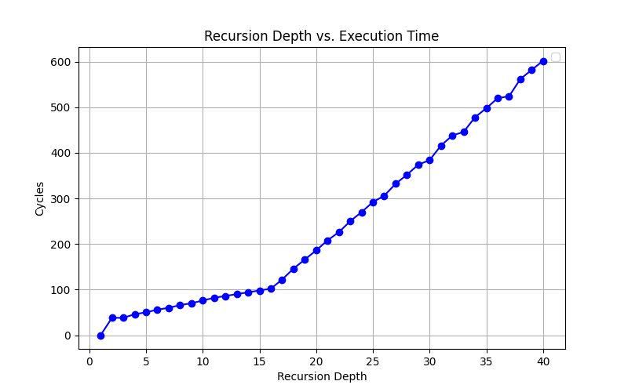

# The RAS Channel
## Theory
### Microarchitectural Basis
The return address stack (RAS) is a microarchitectural structure that optimizes function 
calls. Every time a function is called, its return address is added to the stack. When the 
function completes execution, its return branch may be executed speculatively simply by popping the top of the stack. Because it's a microarchitectural structure, the RAS size is limited, so if the call stack is too deeply nested, earlier return branches are ejected, and their return addresses must be computed directly, costing execution time.

### RAS Timing Side-Channel
The limited capacity of the RAS, combined with the fact that it is shared among all 
processes on a core, exposes a potential side-channel that can be used to build a covert 
channel. A sending process is able to influence the time taken for a receiving process to 
return from a heavily nested process by flushing the RAS with its own heavily nested 
process.

### Implementation
To flesh out the covert channel implementation, we first need to know the size of the 
return address stack. To maximize the covert channel's accuracy, we will want to configure 
the receiving process to be nested exactly as deeply as the RAS is. This is the point at which the difference in return times is largest. RAS size can be 
benchmarked by timing execution time for increasingly nested functions and identifying the inflection point where the additional execution time per level of nesting increases. A graph is shown below, showing the time to return from a nested function with no other overhead. 



On the Google Cloud Instance, the RAS capacity is 16.

Once the RAS capacity is known, the implementation of the send and receive functions are as follows:

```
// SENDING
static inline void flush_ras(int count, int threshold){
    if (count == threshold) {
        sched_yield();
        return;
    }
    else flush_ras(++count, threshold);
}

// RECEIVING
static inline uint64_t recurse_and_yield(int depth, int count){
    if (count == depth){
        // Yield to transmitter process
        sched_yield();
        return rdtscp64();
    }else{
        if (count == 0){  // Last to return (assuming depth > 0)
            uint64_t start = recurse_and_yield(depth, count+1);
            return rdtscp64() - start;
        }
        else return recurse_and_yield(depth, count+1);
    }
}
```

To exchange information, the receiver first descends to its full depth of recursion. At 
this point, the RAS is now full with the receiver's return addresses. Then, it yields control to other 
processes on the core. At this point, the sender may flush the RAS by calling its own 
nested functions, or it may not. By measuring the time to return from its nested calls, the 
receiver can determine the activity of the sending method. If the return time is above a certain
threshold, the incoming bit is interpreted as a 1.

## Results
### Basic Case
In the basic case, the sender-receiver structure works fairly well. That is, sending a constant stream
of either ones or zeros leads close to perfect accuracy with reasonable bandwidth.

```
| Target Bit  | Bandwidth (kb/s) | Accuracy |
|      0      |      581         |   96.0%  |
|      1      |      203         |   99.9%  |
```

Note firstly that these tests were performed using a cycle threshold obtained as the average
of average flush return times and average non-flushed return times.
Next, note the difference in bandwidth between the all zero and the all ones case. The likely
cause is the need for the receiver to wait for the sender's RAS flush when receiving a 1. For
a load consisting of a roughly even number of ones and zeros, we expect a bandwidth that's
roughly average the two experimental values.

The theoretical bandwidth is limited only by the speed of the nested function invocations and timing logic. At their
most optimized, the bare-bones recursive calls and system timestamp calls required to make this method
work should run on the order of tens of cycles per bit. Conservatively assuming 20 cycles per bit, we
can compute the expected bandwidth for a 2.6 GHz processor of 2.6 GHz / 20 = 130 kb/s.

### More Advanced Transmission
To test the channel's effectiveness with more sophisticated loads, we wrap the basic channel
in an ARQ protocol, the core of which remains the receive_bit and send_bit functions (details
of the ARQ wrapper found in the flush and reload section). This adds some complication to the
implementation. 

1. Threshold detection from a single process requires careful multithreading, and it takes
relatively long, making it reasonable to compute the detection threshold only once per
communication session, rather than once per data packet. The threshold is prone to drift due to 
competing processe as well as processor voltage control and power saving settings, and any
changes during communication will disrupt the channel. 
2. In the more advanced case, time synchronization becomes crucial. The sender-receiver method
requires precise juggling of processor control. To mitigate perturbations, the receive and send
methods average across roughly 600 instances to decide the final return time, but the timing
is still imperfect.
3. The channel seems to exhibit a kind of inertia, where quickly swapping between sending ones 
and zeros is unreliable. It's unclear what causes this, but it's likely related to the process
control involved and the added overhead from the ARQ wrapper. Ultimately, this prevents the 
channel from correctly assembling valid packets and the receiver from interpreting them. Averages
of receiveed bits across larger time frames could likely be taken, but with a massive penalty to
bandwidth.

## Codebase
There are two relevant subdirectories in this directory.

`./basic` - Contains code for a basic implementation of the covert-channel. Running `make` will generate four executables: `benchmark`, `threshold`, `sender`, and `receiver`.
- `benchmark`: Generates data that can be plotted to determine RAS size.
- `threshold`: Continuously averages return time for a flushed and non-flushed RAS.
- `sender`: Repeatedly flushes the RAS to send ones (note: must use taskset to pin to the same CPU as receiver)
- `receiver`: Repeatedly checks nested return time to read incoming data from sender (note: must use taskset to pin to the same CPU as sender)

`./arq_ras` - Contains a client-server ARQ implementation with the RAS channel as its backend. Run `make all` to generate tests and targets, and `make test` for tests only.
- `arq_client` - the ARQ client; sends bits as requested when the server is running. Run using `taskset -c 0 ./arq_client <message>
- `arq_server` - the ARQ server; listens for and acknowledges incoming messages. Run using `taskset -c 0 ./arq_server`
- `send_bitstream` - Repeatedly sends a bitstream to the listener function. Run using `taskset -c 0 ./send_bitstream <bitstream>`
- `receive_bistream` - Constantly listens for incoming bitstream. Run using `taskset -c 0 ./receive_bitstream`

## Cloud Instance Parameters
```
machine-type: n2-standard-2
CPU Platform: Intel Cascade Lake
Architecture: x86/64
```
